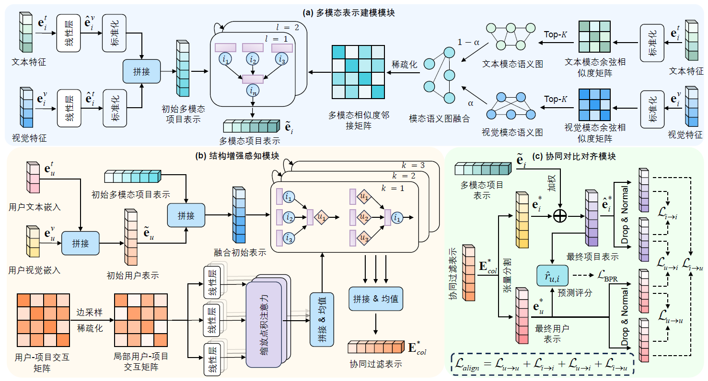

# DANCE: Dual Alignment with Contrastive Enhancement for Multimodal Recommendation

## Introduction

This is the Pytorch implementation for our paper: Dual Alignment with Contrastive Enhancement for Multimodal Recommendation

## Overview

The structure of our model is available for viewing in the following:
<p align="center">
   
</p>


### Enviroment Requirement

- python == 3.8

- Pytorch == 1.10.2

Of course, you can easily install all requirements with `pip install -r requirements.txt`.

### Datasets

Following the majority of previous work, we utilized three datasets from [Amazon](http://jmcauley.ucsd.edu/data/amazon/links.html), namely Baby, Sports, and Clothing, each containing a combination of textual and image information. 
Rating file in `Files/Small subsets for experimentation`
Meta files in `Per-category files`, [metadata], [image features]
Note that there has been an issue with the dataset site lately, as it automatically redirects to an updated version of the dataset. Keep pressing `ESC` to stop the redirecting action.
You could preproces from raw data as the following steps:
1. Enter `preproccess` folder with ```cd ./DANCE/preproccess```
2. Performing 5-core filtering, re-indexing - `run 0rating2inter.ipynb`
3. Train/valid/test data splitting - `run 1spliting.ipynb`
4. Reindexing feature IDs with generated IDs in step 1 - `run 2reindex-feat.ipynb`
5. Encoding text/image features - `run 3feat-encoder.ipynb`
6. Filling your data description file `*.yaml` under `src/configs/dataset` with the generated file names `*.inter`, `*-feat.npy`, etc.
7. Specifying your evaluated dataset by cmd: `python -d sports -m BM3`.

Here, we directly present their embeddings.
You could download all the datasets from Google Drive: [Baby/Sports/Clothing](https://drive.google.com/drive/folders/1BxObpWApHbGx9jCQGc8z52cV3t9_NE0f). 

### Training

1. Put your downloaded data or processed data (e.g. `Sports`) under ``DANCE/data/Sports`` dir.
2. Enter `src` folder with ```cd ./DANCE/src```
3. run with`python main.py -m FREEDOM -d baby`
4. You may specify other parameters in CMD or config with `configs/model/DANCE.yaml` and `configs/dataset/*.yaml`.

### Performance Comparison

| Dataset | Baby | Baby  | Baby | Baby | Sports | Sports | Sports | Sports | Clothing | Clothing | Clothing | Clothing |
|---------|-------------|-------------|-------------|-------------|---------------|---------------|---------------|---------------|-----------------|-----------------|-----------------|-----------------|
| Method  | R@10 | R@20 | N@10 | N@20 | R@10 | R@20 | N@10 | N@20 | R@10 | R@20 | N@10 | N@20 |
| **传统推荐方法** |
| MF-BPR (UAI’09)     | 0.0357 | 0.0575 | 0.0192 | 0.0249 | 0.0432 | 0.0653 | 0.0241 | 0.0298 | 0.0187 | 0.0279 | 0.0103 | 0.0126 |
| LightGCN (SIGIR’20) | 0.0479 | 0.0754 | 0.0257 | 0.0328 | 0.0569 | 0.0864 | 0.0311 | 0.0387 | 0.0340 | 0.0526 | 0.0188 | 0.0236 |
| DirectAU (KDD’22)   | 0.0460 | 0.0672 | 0.0263 | 0.0318 | 0.0630 | 0.0958 | 0.0351 | 0.0436 | 0.0468 | 0.0683 | 0.0257 | 0.0311 |
| LayerGCN (IJDE’23)  | 0.0529 | 0.0820 | 0.0281 | 0.0355 | 0.0594 | 0.0916 | 0.0323 | 0.0406 | 0.0371 | 0.0566 | 0.0200 | 0.0247 |
| **多模态推荐方法** |
| VBPR (AAAI’16)      | 0.0423 | 0.0663 | 0.0223 | 0.0284 | 0.0558 | 0.0856 | 0.0307 | 0.0384 | 0.0281 | 0.0415 | 0.0158 | 0.0192 |
| MMGCN (MM’19)       | 0.0378 | 0.0615 | 0.0200 | 0.0261 | 0.0370 | 0.0605 | 0.0193 | 0.0254 | 0.0218 | 0.0345 | 0.0110 | 0.0142 |
| SLMRec (TMM’22)     | 0.0529 | 0.0775 | 0.0290 | 0.0353 | 0.0663 | 0.0990 | 0.0365 | 0.0450 | 0.0452 | 0.0675 | 0.0247 | 0.0303 |
| MICRO (TKDE’22)     | 0.0584 | 0.0929 | 0.0318 | 0.0407 | 0.0679 | 0.1050 | 0.0367 | 0.0463 | 0.0521 | 0.0772 | 0.0283 | 0.0347 |
| BM3 (WWW’23)        | 0.0564 | 0.0883 | 0.0301 | 0.0338 | 0.0656 | 0.0980 | 0.0355 | 0.0438 | 0.0422 | 0.0621 | 0.0231 | 0.0281 |
| FREEDOM (MM’23)     | 0.0627 | 0.0992 | 0.0330 | 0.0424 | 0.0717 | 0.1089 | 0.0385 | 0.0481 | 0.0629 | 0.0941 | 0.0341 | 0.0420 |
| MGCN (MM’23)        | 0.0620 | 0.0964 | 0.0339 | 0.0417 | 0.0729 | 0.1068 | 0.0397 | 0.0496 | 0.0441 | 0.0945 | 0.0347 | 0.0428 |
| LGMRec (AAAI’24)    | 0.0644 | 0.1002 | 0.0349 | 0.0440 | 0.0720 | 0.1068 | 0.0390 | 0.0480 | 0.0555 | 0.0828 | 0.0302 | 0.0371 |
| DGHNet (KBS’25)     | 0.0620 | 0.0985 | 0.0328 | 0.0418 | 0.0693 | 0.1043 | 0.0376 | 0.0475 | 0.0500 | 0.0792 | 0.0282 | 0.0358 |
| TMPL (AAAI’25)      | 0.0671 | 0.1016 | 0.0360 | 0.0449 | 0.0769 | 0.1152 | 0.0416 | 0.0515 | 0.0646 | 0.0959 | 0.0354 | 0.0433 |
| MENTOR (AAAI’25)    | 0.0648 | 0.1031 | 0.0350 | 0.0448 | 0.0757 | 0.1134 | 0.0405 | 0.0505 | 0.0662 | 0.0967 | 0.0361 | 0.0439 |
| COHESION (SIGIR’25) | 0.0680 | 0.1052 | 0.0354 | 0.0454 | 0.0752 | 0.1140 | 0.0409 | 0.0503 | 0.0665 | 0.0983 | 0.0358 | 0.0438 |
| **DANCE (Ours)**    | **0.0696*** | **0.1061*** | **0.0374*** | **0.0465*** | **0.0832*** | **0.1198*** | **0.0465*** | **0.0559*** | **0.0721*** | **0.1044*** | **0.0393*** | **0.0476*** |
| Improvement         | 2.35%↑ | 0.85%↑ | 3.89%↑ | 2.42%↑ | 8.19%↑ | 3.99%↑ | 11.78%↑ | 8.54%↑ | 8.42%↑ | 6.21%↑ | 8.86%↑ | 8.43%↑ |

